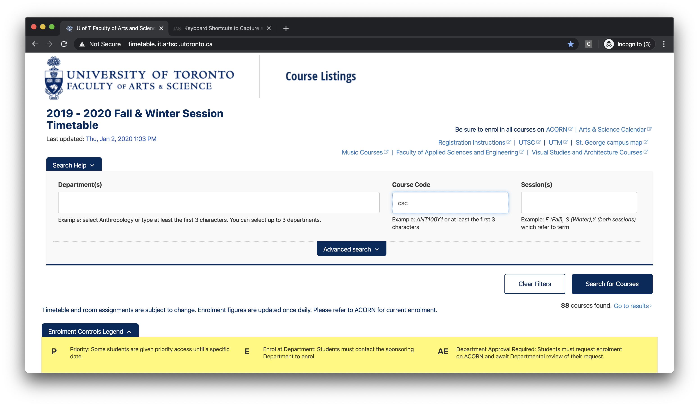
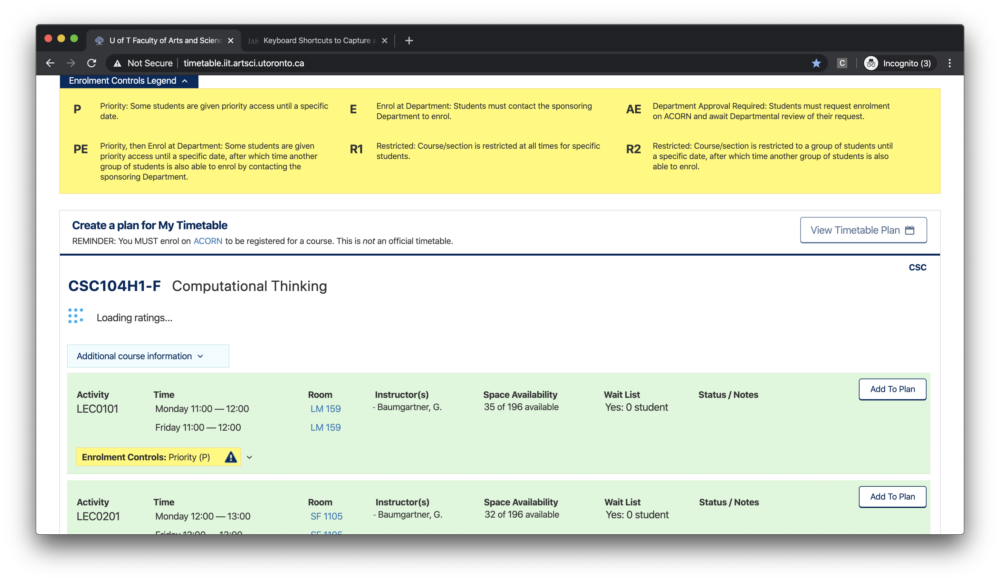
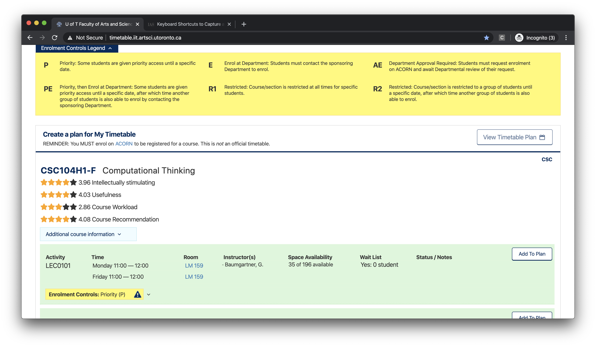
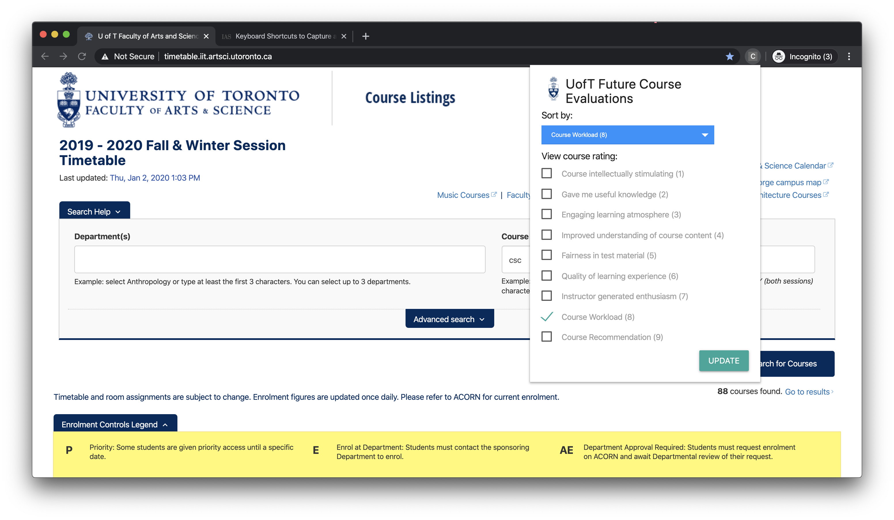
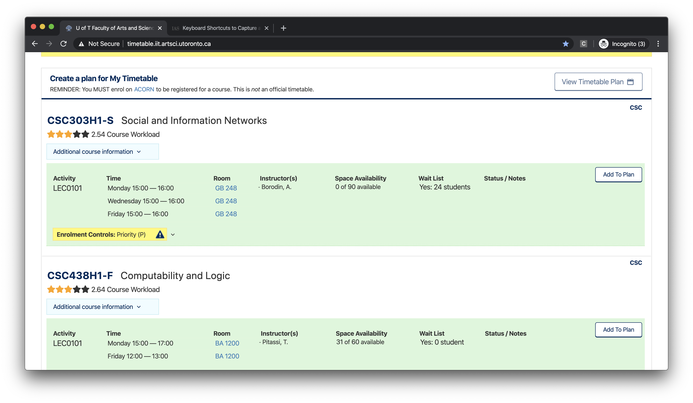

# UofT Future Course Evaluations

### Description
The UofT Future Course Evaluations aims to help students choose courses by embedding **future course evaluations** on the UofT Timetable (https://timetable.iit.artsci.utoronto.ca/). Future course evaluations are obtained using a machine learning model that uses past course evaluations to predict how well a course will be run by a specific instructor.

The UofT Future Course Evaluations project is a full stack web development project. It is comprised from several components: the Web Scraper, the Data Professor, the Database, the ML Model, the Flask Web API, and the Chrome Extension.

### Table of Contents
- Walkthrough
- Installation
- Deploying on AWS
- Usage
- Todo
- Credits
- License

### Walkthrough of this project
First, users will be using the UofT Timetable page (https://timetable.iit.artsci.utoronto.ca/). In the homepage, they will need to specify which courses they are interested in taking.
<div width="100%">
    <p align="center">

    </p>
</div>

After clicking on the search button, it will load the courses and fetch their future course evaluations from the Web Api.
<div width="100%">
    <p align="center">

    </p>
</div>

Once the future course evaluations load, it will display the course evaluations below each course listing.
<div width="100%">
    <p align="center">

    </p>
</div>

In addition, users are able to sort the course listings and/or toggle the visibility of course evaluations in the Chrome Extension. For instance, users can sort course listings based on their workloads and only show their course workloads.
<div width="100%">
    <p align="center">

    </p>
</div>

After clicking the Update button on the Chrome Extension, it will update the course listings.
<div width="100%">
    <p align="center">

    </p>
</div>

Chrome Extension on the Chrome Web Store: [https://chrome.google.com/webstore/detail/uoft-timetable-course-rat/hkkijphcfllifpnmagnanfdonfemgoec?authuser=1](https://chrome.google.com/webstore/detail/uoft-timetable-course-rat/hkkijphcfllifpnmagnanfdonfemgoec?authuser=1)

Live HTTP instance of Web Api on AWS: [http://uoft-future-course-evals-lb-1-756647563.us-east-1.elb.amazonaws.com/](http://uoft-future-course-evals-lb-1-756647563.us-east-1.elb.amazonaws.com/)

Live HTTPS Proxied instance of Web Api on AWS: [http://uoft-project.herokuapp.com/](http://uoft-project.herokuapp.com/)

### Installation
##### Required Programs and Tools:
- Local instance of Apache Spark
- Python 3
- Unix machine

##### Step 0: Install libraries
1. Update pip by running the command ```pip install --upgrade pip```
2. In the root folder of the project, run ```pip3 install -r requirements.txt```

##### Step 1: Scrapping course evaluations
1. In the **Web Scraper** folder, copy the file *.env-template*, and rename it to *.env*.
2. Open the **.env** file and replace the contents to your Utorid and your Utorid password.
     - For instance, if your utorid is *lfirstname* and your utorid password is *123*, then your *.env* file should look like:
          ```
          UTOR_ID=lfirstname
          PASSWORD=123
          ```
2. In the terminal, run ```python3 main.py```. It will dump the scrapped course evaluations to a csv file named *raw-data.csv*.

##### Step 2: Process the data:
1. In the **Data Processor** folder, create a folder called *data*
2. Copy the csv file *Web Scraper/raw-data.csv* to the *Data Processor/data/* folder
3. In the terminal, change directories to the **Data Processor** folder, and run ```spark-submit pre-process.py```

##### Step 3: Dump the processed data to the database
1. In the **Data Processor** folder, copy the file *.env-template*, and rename the copied file to *.env*.
2. In the *.env* file, replace the contents to your DB credentials with **WRITE** permissions
3. In the terminal, run ```python3 database-populator.py```

##### Step 4: Train the ML model
1. In the **ML Model** folder, run the command ```python3 ml.py```

##### Step 5: Run the Web App
1. In the **Web App** folder, copy the file *.env-template*, and rename the copied file to *.env*.
2. In the *.env* file, replace the contents to your DB credentials with **READ** permissions
3. In the **Web App** folder, run the command ```python3 app.py```

##### Step 6: Running the Chrome Extension:
1. Open Google Chrome **without web security** (to disable CORs)
2. Go to *chrome://extensions*
3. Drag and drop the **Chrome Extension** folder to that webpage
4. Go to *https://timetable.iit.artsci.utoronto.ca/*
5. Load some courses on the webpage
6. On the top of the browser, there will be a warning sign about loading unsafe scripts. Click on it and allow loading unsafe scripts
7. Reload the page
8. Load some courses. It should now show the predicted course ratings.

### Deploying on AWS
- Refer to [Docs for AWS](docs/deployment-readme/README.md)

### Todo
- Add a web page justifying why its predicted course rating is the way it is (by displaying real past data)
- Add a link to that web page below the course ratings

### Usage
Please note that this project is used for educational purposes and is not intended to be used commercially. We are not liable for any damages/changes done by this project.

### Credits
Emilio Kartono, who made the entire project.

### License
This project is protected under the GNU licence. Please refer to the LICENCE for more information.
