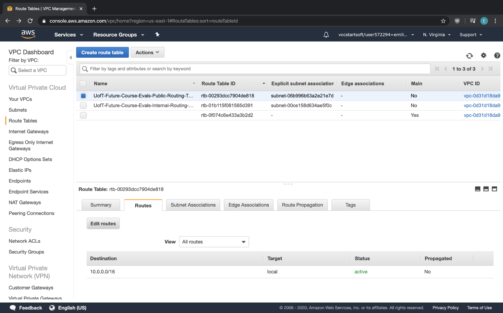

# Deploying to AWS:

## Introduction:
Deploying the app to AWS involves various steps:
1. Setting up the VPC
2. Setting up the Postgresql Database
3. Setting up the EC2 instance
4. Setting up the app
5. Adding a load balancer

## Step 1: Setting up the VPC:
A VPC is comprised of a collection of subnets, route tables, internet gateways, and security groups. Our VPC will consist of:
- Two public subnets attached to a common public route table
- Two private subnets attached to a common private route table
- A security group for our database (to protect our database from unwanted traffic)
- A security group for our EC2 instance (to protect our EC2 instance from unwanted traffic)
- An internet gateway (to allow our EC2 instance to talk to the internet)
- A Network Access Control List (to protect our VPC from unwanted traffic)


## Deploying UofT Future Course Evaluations to AWS**

It involves:
1. Setting up the VPC
2. Setting up a Postgresql
3. Setting up an EC2 instance
4. Setting up the app
5. Adding a load balancer

## Step 1: Setting up the VPC:**

* This is about creating a VPC so that we have our own private network

#### 1. To create a VPC:
        
1. Type in VPC in the search bar:


2. Then, click on “Your VPC” and select “Create your VPC”:


3. Type in a name for your VPC with the submask being “10.0.0.0/16”. Then, click “create”:


4. Then click “create”. You have made your VPC

#### 2. Creating subnets
*   To set up the internal and external parts of the VPC, we need to make subnets
    *   Subnets further divide the VPC
*   We need to make these subnets:
    *   Private subnet 1
    *   Private subnet 2
    *   Public subnet 1
*   Note that we need to make two private subnets for our database (more in that later)
*   To create our internal subnet #1:
1. In the VPC page, click on “Subnets” and click on “Create Subnets”:


2. Then, set the VPC to the VPC we made earlier, and IPv4 CIDR block “10.0.1.0/24”. Then click “create”:


3. You have made your internal subnet
*   To create our private subnet #2:
    *   Same as creating our private subnet #1 but:
        *   Set the IPv4 CIDR block to “10.0.2.0/24”
        *   Set the Availability Zone to something different from the Private Subnet #1’s Availability Zone
*   To create our external subnet:
1. In the VPC page, click on “Subnets” and click on “Create Subnets”:


2. Then, set the VPC to the VPC we made earlier, and IPv4 CIDR block “10.0.0.0/24”. Then click “create”:


3. You have made your public subnet

#### 3. Creating the Internet Gateway
*   This is important since it allows your public subnet to be connected to the internet.
*   To create an internet gateway:
1. Go to “Internet Gateways” and click on “Create internet gateway”:


2. Then, name your gateway and click “Create”:


3. You will notice that it is “detached”. That means that it is not attached to any VPC yet:


4. To attach it to a VPC, click on the internet gateway, select “Actions”, and click on “Attach to VPC”:


5. Then, select our VPC and click “Attach”:


6. Now it is attached to our VPC and we have made our Internet Gateway:


#### 4. Creating routing tables
What is a Routing Table?
*   Routing tables is needed so that instances running in different subnets can talk to each other.
*   Moreover, it defines which subnets are allowed to talk to the Internet Gateway and back
*   It is a duplex connection
*   A new routing table should be specified for each subnet (though multiple subnets can share the same routing table)

What we want:
*   We want a routing table for the private subnet so that any traffic made coming from the private subnet will point to an instance in the VPC
*   We want a routing table for the public subnet so that any traffic made coming out from the public subnet will first point to an instance in the VPC; else to the Internet Gateway

To create the routing table for our private subnet:
1. Go to the “Routing Table” tab, and click on “Create Routing Table”:


2. Then, name the routing table and attach our VPC to that routing table:


3. Then click “Create”. It now should look like:


4. Now we need to attach it to our private subnet. To do this, select our private routing table, select the “Subnet Associations” tab, and click on “Edit subnet associations”:


5. Then, select our private subnet, and click “Create”:


6. Note that you don’t need to change the routing table entries because by default, it already included the VPC’s routing entry in the routing table for you:


7. You have successfully created a routing table for your private subnet

To create the routing table for our public subnet:
1. Create a new routing table:


2. Enter the name and our VPC:


3. Attach the routing table to our public subnet:


4. Contrary to the private subnet, we need to allow the public subnet to reach the internet gateway. To do this, we need to make a new entry in the routing table mapping 0.0.0.0/0 (meaning to match any IP address) to the Internet Gateway
*   Recall that in CIDR, it will match the longest prefix. Thus, 0.0.0.0/0 means that it will route the traffic to the Internet Gateway if it does not match to our VPC table entry



Then click “Create”


5. You have successfully created a routing table for your public subnet

#### 5. Creating security groups
*   What are security groups?
    *   A way to whitelist traffic entering in and out of the subnet by examining each packet and its type
    *   They are applied to instances (ex: EC2s, RDS, etc)
*   What we want:
    *   We want to allow SSH traffic coming into our EC2 instance

Creating the security group for our EC2 instance:
1. Go to “Security Groups” tab, and click on “Create Security Group”:


2. Enter a name, description, and our VPC:


3. Now we need to set up the outbound traffic:
*   Outbound traffic defines what can be sent out from the subnet
*   We want anything to come out from the subnet
*   To do this, follow these:

4. Select our Security Group, and click on the “Outbound Rules”:


5. It should already have it there

6. Now we need to set up the inbound traffic:
*   Inbound traffic defines what internet traffic can enter our subnet
*   We want only SSH from anywhere to enter our subnet (for now)

            To do this follow the following:

7. Select our Security Group, click on the “Inbound Rules”, and click on “Edit Rules”:


8. Add an SSH entry for IP mask 0.0.0.0/0 (note that CIDR still plays a role in this):   


9. You have successfully made a security group for your public subnet

Creating the Security Group for RDS:
*   Same as creating a security group for EC2 but rename it differently

#### 6. Creating the Network Access Control List:
*   A Network Access Control List is a firewall for the entire VPC (similar to security groups but for the entire VPC)
*   Note that by creating a VPC, it has already created a Network Access Control List:


## Step 2: Creating the Postgresql Database

* We need to create a RDS database to store the course ratings
* To create a RDS database, we need to:
#### 1. Create a DB Subnet Group:
A DB Subnet group is a collection of subnets placed in a group
* A minimum of two subnets needs to be placed in this group
A DB Subnet group is needed for any DB running on AWS.

To create a DB subnet group:
1. Go to services and type in “RDS”:


2. Go to Subnet Groups and click on “Create Subnet Group”:


3. Then specify the following:
* The name of your DB subnet group
* The two private subnets
* It should look like this:


Then click “Create”

#### 2. Create a DB instance:
1. Go to services and type in “RDS”:


2. Then click on “Create Database”:


3. Next, we create our database by specifying the following:
*   Database Creation Method: Easy Create
*   Engine Type: Postgresql
*   DB Instance Type: Free Tier
*   DB instance name: UofT-Future-Course-Evals-DB
*   Master username: uoft
*   Master password: any
*   VPC: our VPC
*   Subnet group: the DB Subnet group we made
*   Publically Accessible: no
*   Security Group: the security group for our RDS
*   Initial Database Name: uoftcourseevals

Then click on “Create”

4. It take a while for the DB to be created. The page should look like this:


## Step 3: Setting up the EC2 Instance:
* Creating a web server involves creating an EC2 instance inside the public subnet

#### 1. Creating the EC2 Instance:**

1. Go to services and type in “EC2”:


2. Go to the “EC2 dashboard” and select “Launch instance”:


3. Select the free tier Ubuntu 18:


4. Select the free tier for the instance type and click Next:


5. Set the VPC to our VPC, the subnet to the public subnet, and enable “auto assign public IP” (it should assign the public IP to the public IP in the Internet Gateway). Then click Next:


6. Click Next:


7. Click Next:


8. In this page, select our public security group that we made earlier:


9. Click “Review and Launch”:


10. We need to create an SSH key in order for us to access our EC2 instance. To do this, after clicking launch, it will ask us for an SSH key. Tell AWS to create it for us, and download the SSH key to your local machine:


Then click “Next”

11. You should see this:


12. When you click on “View Instances”, it should show this page:


where your EC2 instance is initializing.


#### 2. SSH Into your EC2 instance:**

1. First find your EC2 instance’s public IP address. It can be found in the EC2 page:


2. On your local machine, open up the terminal, change directories to the directory in which the key is stored, and reduce permissions on the SSH key by running the command:


3. SSH into the machine with the specified key pair by run the following command:

```
ssh -i "UofT-Future-Course-Evals-EC2-SSH-Key.pem" ubuntu@100.25.29.215
```


## Step 4: Installing the Web App**

#### Allow access from EC2 to Postgres:
Currently, the security group for our database does not accept any incoming requests

We need to change it so that it only allows requests coming out from the EC2 instance
* We do this by adding a new incoming rule in the DB’s security group so that it allows any traffic coming from the EC2’s security group

Steps:
1. Go to the Amazon console, search for “VPC”, and go to the “Security Groups” tab:


2. Click on the EC2’s security group, and go to the “Description” tab. \
Copy its Group ID:


3. Next, click on the DB’s Security Group, select “Inbound Rules”, and select “Edit Rules”:


4. Then, create a new rule allowing any traffic to come from the EC2 instance:


5. You are done!

#### Install the Postgresql Client:

We need to do this so that our EC2 instance can connect to our database

Steps:
1. Install the Postgresql Client:
        ```
        sudo apt-get install postgresql-client
        ```
2. Obtain your DB’s endpoint and port number by going to RDS → Databases → Your DB. 

The page should look like this:


3. Now, in the terminal, SSH into your EC2 instance, and run the command:
        ```
        psql -h uoft-future-course-evals-db.cmaqtpngmxxb.us-east-1.rds.amazonaws.com -p 5432 -d uoftcourseevals -U uoft
        ```

It should look like this:


4. Enter your credentials
5. If it is successful, it should look like this:


6. Congratulations! You have successfully connected to your DB in your EC2 instance!

#### Migrate local database to database on AWS

We will want to dump our contents from our local Postgresql instance to the Postgresql instance on AWS

To do this, we will need to:
*   Dump the entire local database to a file
*   Send the file to our EC2 instance
*   SSH into our EC2 instance
*   Upload the file to our remote Postgresql database on AWS

Steps:
1. Dump the entire local database to a file:
    1. First, ensure that your local database is running
    2. Next, run the command:

        ```
        pg_dump -U emiliokartono -O uoft_future_course_evaluations -f sourcedb.sql
        ```

        It will dump the entire database to a file called sourcedb.sql

2. Send the file to your EC2 instance using SCP
* We do this with the scp command.
* Run the command:

        ```
        scp -i "UofT-Future-Course-Evals-EC2-SSH-Key.pem" sourcedb.sql ubuntu@100.25.29.215:”~/”
        ```

If successful, it should like this:     


3. SSH into your EC2 instance
* Refer to previous steps on how to do this
4. Upload the file to our remote Postgresql database on AWS
* To upload your file to your remote Postgresql database on AWS, run the command:

        ```
        psql -h uoft-future-course-evals-db.cmaqtpngmxxb.us-east-1.rds.amazonaws.com -p 5432 -d uoftcourseevals -U uoft < sourcedb.sql
        ```
on your EC2 instance

So now when you access the DB and look at all the tables, it should have your tables:


5. You have finished migrating your local Postgresql DB to AWS

#### Copy over the source files of your web app
Easiest way is to clone the repository:

To do this:
1. SSH into your EC2 instance and run the command:

        ```
        git clone [https://github.com/EKarton/UofT-Future-Course-Evaluations.git](https://github.com/EKarton/UofT-Future-Course-Evaluations.git)
        ```

2. Next, install pip3 by running the command:

        ```
        sudo apt install python3-pip
        ```

3. Then, change directories to the source folder, and install the requirements by running:

        ```
        pip3 install -r requirements.txt
        ```

#### Change security groups so that it accepts connections to the web app

It is possible to run your app, but it will not be able to serve requests outside of your EC2

The solution:
    *  To add a whitelist to your EC2’s Security Group so that it accepts HTTPS requests to your Web App’s port

Steps:
1. Go to the AWS console, search for “VPC”, select “Security Groups”, select your EC2’s Security Group, and edit the rules in the “Inbound Rules” tab:


2. Next, add a new rule allowing HTTPS to our web app:


3. Then save it.

## Step 5: Add a load balancer for your EC2:

*   We wanna make a load balancer for our EC2 so it can handle many requests
    *   This is only beneficial if we have more than one EC2 instance
*   To do this we need to:

#### 1. Go to the EC2 page:


2. Then, click on the “Load Balancers” tab and click on “Create Load Balancer”:


3. Next, specify that you want to make a **Classic Load Balancer**:


4. Set the:
*   Name of the load balancer
*   The port in the EC2 instance(s)
*   The VPC
*   The subnet (note that the subnet should be in the public subnet):
The page looks like this:


5. Create a new security group of the LB with only HTTP allowed to enter inside the load balancer:


6. Set the Health Check:


7. Select our EC2 instance(s):


8. Finally, click “Create”:


9. Note that in order for the load balancer to work, it will need 10 successful health checks to our EC2 instance(s) for our load balancer to be “healthy”. Thus, in our load balancer config page it will show:


10. This will take around 10 minutes. Please wait while the load balancer registers 10 consecutive health checks to our EC2 instance
11. Once the load balancer registers 10 consecutive health checks from our EC2 instance, it will change its status to “InService”:


12. Copy the load balancer’s DNS name on the load balancer’s description panel:


13. You can navigate to our load balancer by entering the load balancer’s DNS name on your browser:


